# Visão geral e escopo

## Objetivo

O Growth Loop transforma participantes em um canal de aquisição. Uma empresa cria uma campanha, oferece uma recompensa inicial, entrega um link individual ao participante e concede uma segunda recompensa quando um número configurado de amigos indicados se qualifica.

## Perfis

### Administrador da plataforma

Usuário `ADMIN`. Pode informar um `clientId` nas operações de campanhas. Quando nenhum tenant é informado ou associado à sessão, a implementação atual seleciona o primeiro cliente criado.

### Usuário de empresa

Usuário `CLIENT`. Só acessa dados do `clientId` associado ao seu usuário, independentemente de parâmetros enviados pelo cliente HTTP.

### Participante

Pessoa cadastrada em uma campanha pública. Não usa sessão NextAuth: recebe um token opaco no cadastro, cujo hash é persistido, e um código público de indicação.

### Indicado

Novo participante que chega com `?ref=<codigo>`. Seu cadastro pode criar uma relação de indicação com o participante que compartilhou o link.

## Conceitos do domínio

| Conceito | Significado |
| --- | --- |
| Tenant/Client | Empresa dona das campanhas e dos dados |
| Campanha | Configuração do loop, identidade, recompensas e meta |
| Página da campanha | Conteúdo da experiência pública |
| Participante | Pessoa cadastrada que pode indicar amigos |
| Lead | Contato capturado pela campanha |
| Indicação | Atribuição entre participante indicador e indicado |
| Recompensa | Benefício configurado para um marco |
| Concessão | Registro imutável/idempotente de uma recompensa liberada |
| Regra versionada | Snapshot da regra aplicada à campanha ou recompensa |
| Consentimento | Evidência de aceite de termos e privacidade |
| Evento de domínio | Registro para processamento assíncrono futuro |
| Auditoria | Registro de ação administrativa relevante |

## Jornada principal

```mermaid
flowchart LR
    A["Empresa cria a campanha"] --> B["Empresa ativa a campanha"]
    B --> C["Pessoa acessa /growth-loop/slug"]
    C --> D["Pessoa aceita termos e se cadastra"]
    D --> E["Lead e participante são persistidos"]
    E --> F["Recompensa inicial é concedida"]
    F --> G["Acesso à recompensa é confirmado"]
    G --> H["Participante compartilha seu link"]
    H --> I["Amigo entra com código de indicação"]
    I --> J["Amigo se cadastra e acessa a recompensa"]
    J --> K["Indicação é qualificada"]
    K --> L{"Meta atingida?"}
    L -- "Não" --> H
    L -- "Sim" --> M["Recompensa de marco é concedida"]
```

## Fronteiras atuais

O sistema implementa o núcleo transacional do loop e algumas consultas administrativas. Não há, no código atual, processamento de e-mails, entrega de webhooks, resgate de recompensa, edição completa da página, motor de antifraude ou métricas reais no dashboard/relatórios.

Essa distinção é detalhada em [Status, limitações e evolução](09-status-e-evolucao.md).

