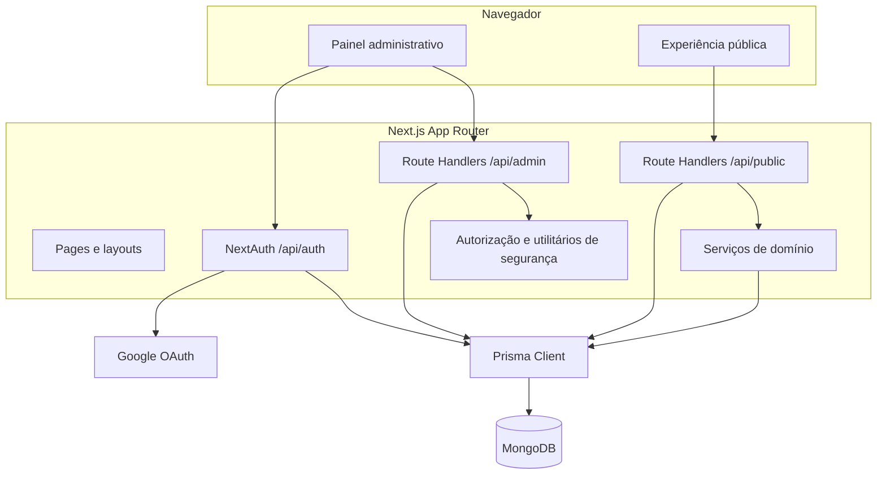

# Arquitetura e estrutura

## Visão lógica



## Camadas

### Apresentação

- `app/`: layouts, páginas e endpoints.
- `components/dashboard/`: navegação, cabeçalhos e tabelas.
- `components/campaigns/`: listagem e criação de campanhas.
- `components/public/`: cadastro, sucesso e compartilhamento.
- `app/globals.css`: design system global e breakpoints.

Páginas administrativas usam componentes client para buscar dados em `/api/admin`. A página pública recebe `slug` e `ref` no servidor e delega as chamadas para `JoinExperience`.

### Aplicação e HTTP

Os Route Handlers em `app/api` coordenam:

- autenticação e tenant;
- validação Zod;
- consultas e mutações Prisma;
- chamada das regras de domínio;
- definição dos contratos JSON/CSV.

### Domínio

`modules/growth-loop/domain` contém as regras reutilizáveis:

- `referral-service.ts`: valida e qualifica uma indicação;
- `reward-service.ts`: concede recompensa de forma idempotente, recalcula contagem e avalia o marco.

`modules/growth-loop/schemas` contém os schemas Zod de campanha e participante.

### Infraestrutura

- `lib/prisma.ts`: singleton do Prisma Client em desenvolvimento.
- `lib/auth.ts`: NextAuth, Google OAuth e enriquecimento do JWT.
- `lib/authorization.ts`: resolução do tenant da sessão.
- `lib/security.ts`: normalização, hashes e tokens aleatórios.
- `prisma/schema.prisma`: contrato de persistência MongoDB.
- `next.config.ts` e `prisma.config.ts`: carregamento do `.env` pai.

## Estrutura detalhada

```text
freitas-growth-loop-admin/
├─ app/
│  ├─ api/
│  │  ├─ admin/                 Endpoints autenticados e tenant-aware
│  │  ├─ auth/[...nextauth]/    Login e callback NextAuth
│  │  ├─ public/                Endpoints da experiência pública
│  │  └─ v1/                    Placeholder sem implementação
│  ├─ dashboard/                Páginas administrativas
│  ├─ growth-loop/[slug]/       Página pública da campanha
│  ├─ login/                    Login Google
│  ├─ globals.css               Estilos globais
│  ├─ layout.tsx                Metadata e SessionProvider
│  └─ page.tsx                  Redireciona para /dashboard
├─ components/
│  ├─ campaigns/                Builder e cards de campanha
│  ├─ dashboard/                Sidebar, header e ResourceTable
│  ├─ public/                   Jornada pública
│  └─ providers.tsx             SessionProvider
├─ lib/                         Serviços transversais
├─ modules/growth-loop/
│  ├─ domain/                   Regras de indicação e recompensa
│  └─ schemas/                  Validação de entrada
├─ prisma/schema.prisma         Modelos, enums, índices e relações
├─ types/next-auth.d.ts         Tipos adicionais da sessão/JWT
├─ middleware.ts                Proteção de dashboard e API admin
└─ docs/                        Documentação
```

## Server e Client Components

São Client Components:

- login;
- sidebar;
- tabelas de recursos;
- gerenciador e formulário de campanhas;
- experiência pública;
- provider de sessão.

Layouts e páginas sem `"use client"` permanecem Server Components. Route Handlers executam apenas no servidor.

## Multi-tenancy

O isolamento administrativo é feito por `clientId`:

1. o middleware exige sessão em `/dashboard/*` e `/api/admin/*`;
2. `requireTenant()` lê a sessão no servidor;
3. usuários `CLIENT` sempre usam o próprio `session.user.clientId`;
4. consultas administrativas incluem `where: { clientId }`;
5. mutações verificam a campanha dentro do tenant antes de atualizar.

Campos `clientId` também estão duplicados em entidades operacionais para facilitar isolamento e consultas.

## Estilo e responsividade

O CSS usa variáveis de cor, DM Sans para texto e Manrope para títulos. Os principais breakpoints são:

- até `1100px`: grids reduzidos e preview do builder ocultado;
- até `760px`: sidebar deixa de ser fixa, grids viram uma coluna e páginas públicas/formulários são compactados.

Não há biblioteca de componentes ou CSS Modules; todas as classes estão em `app/globals.css`.

## Decisões relevantes

- JWT evita tabela de sessão, mas permissões ficam válidas até a renovação do token.
- Regras e concessões são versionadas para preservar o contexto histórico.
- `idempotencyKey` evita duplicidade de concessões e eventos.
- Tokens públicos são aleatórios e somente o SHA-256 é persistido.
- O evento `ParticipantRegistered` é gravado no padrão outbox, mas ainda não existe worker consumidor.

