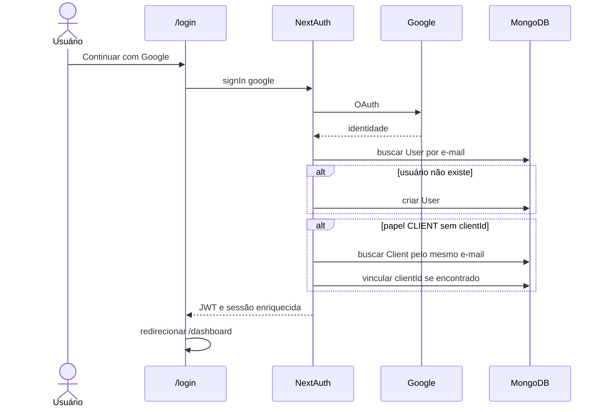
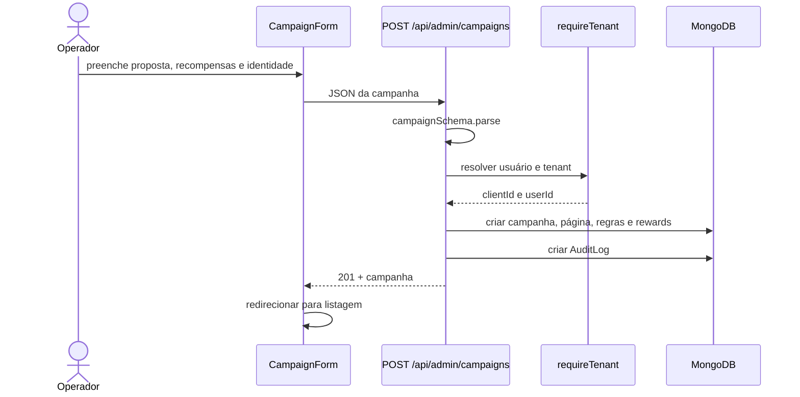
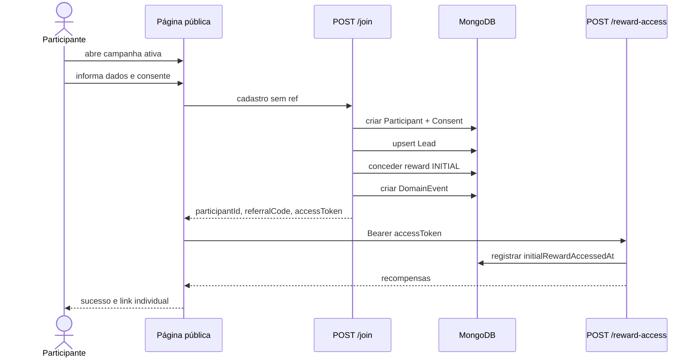
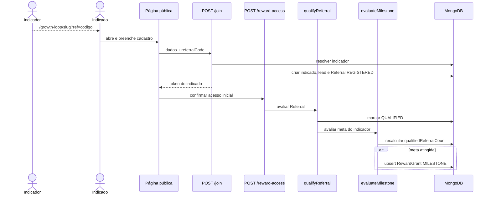
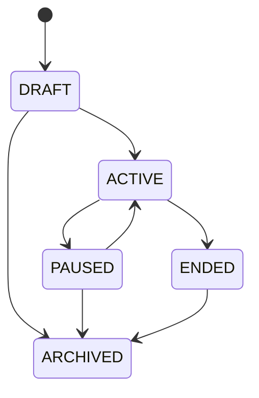
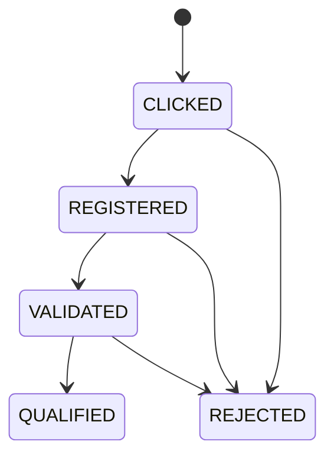
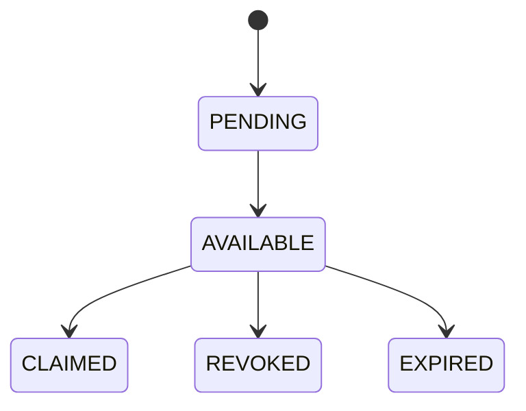

# Fluxos de negócio

## 1. Login e resolução de tenant

Se um usuário `CLIENT` não estiver vinculado a um cliente, endpoints administrativos retornam “Nenhuma empresa vinculada”.

## 2. Criação da campanha

A campanha nasce `DRAFT` e só aparece publicamente após ser ativada.

## 3. Cadastro direto

## 4. Cadastro indicado e qualificação

## 5. Máquina de estados

### Campanha

A API aceita qualquer um dos cinco estados sem impor transições. O diagrama representa o fluxo de negócio esperado; a interface só alterna `ACTIVE` e `PAUSED/ACTIVE`.

### Indicação

O fluxo implementado cria diretamente em `REGISTERED` e depois muda diretamente para `QUALIFIED`.

### Concessão de recompensa

O código atual cria a concessão diretamente como `AVAILABLE`. Resgate, revogação e expiração ainda não têm endpoints.

## 6. Exportação de leads

1. usuário autenticado solicita `/api/admin/export/leads`;
2. tenant é resolvido pela sessão;
3. todos os leads do tenant são carregados;
4. auditoria é gravada;
5. CSV é retornado como download sem cache.

## Regras de idempotência

| Operação | Chave |
| --- | --- |
| Concessão | `campaignId:participantId:rewardId:ruleVersionId:milestone` |
| Evento de cadastro | `participant-registered:<participantId>` |
| Claim futuro | `RewardClaim.idempotencyKey` |
| Webhook futuro | `endpointId + eventId` |

