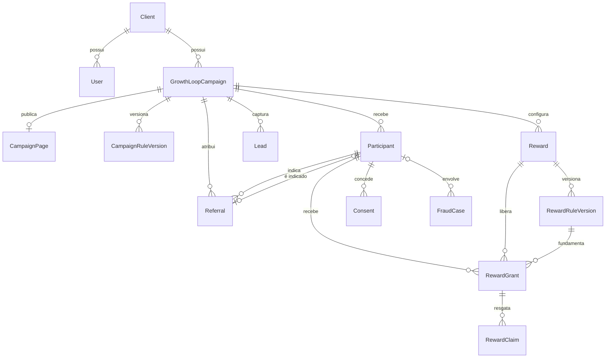

# Modelo de dados

## Banco e ORM

O projeto usa MongoDB com Prisma. IDs são `ObjectId` representados como `String`. Datas de criação são normalmente preenchidas com `now()` e entidades mutáveis usam `@updatedAt`.

## Relações principais

## Identidade e tenant

### `User`

Usuário autenticado. Guarda nome, e-mail único, imagem, papel e `clientId` opcional.

### `Client`

Tenant da aplicação. Possui usuários e campanhas. `email` é único e atualmente também serve para vincular automaticamente um usuário cliente.

## Campanha

### `GrowthLoopCampaign`

Agregado central. Contém:

- tenant, criador, nome, `slug`, descrição e status;
- identidade visual;
- títulos e valores denormalizados das duas recompensas;
- meta de indicações qualificadas;
- vigência opcional;
- relações com página, regras, participantes, leads, rewards, indicações, convites, templates e auditoria.

Restrições:

- `clientId + slug` único;
- índice por `clientId + status`.

### `CampaignPage`

Conteúdo público: headline, subheadline, imagem, corpo, CTA e mensagem de agradecimento. Relação 1:1 por `campaignId`.

### `CampaignRuleVersion`

Snapshot versionado:

- meta;
- exigência de e-mail verificado;
- exigência de acesso inicial;
- bloqueio de autorreferência;
- intervalo de vigência;
- JSON completo da regra.

`campaignId + version` é único.

## Aquisição

### `Participant`

Pessoa que participa do loop. Campos importantes:

- e-mail/telefone originais e normalizados;
- código público de indicação globalmente único;
- hash do token de acesso;
- status e marcos da jornada;
- contagem materializada de indicações qualificadas.

Restrições:

- um e-mail normalizado por campanha;
- código de indicação único;
- índice por tenant, campanha e status.

### `Lead`

Contato capturado, com campanha, participante opcional, origem e UTMs. Um e-mail normalizado só pode existir uma vez por campanha.

### `Invitation`

Convite nominal futuro com indicador, destinatário, token, validade e status. Não é usado pelo fluxo público atual, que compartilha apenas o código de indicação.

### `Referral`

Liga indicador, indicado e convite opcional. Guarda:

- estado da atribuição;
- timestamps do funil;
- motivo de rejeição;
- versão da regra;
- `attributionKey` idempotente/única.

Um participante só pode ser o indicado de uma indicação.

## Recompensas

### `Reward`

Definição do benefício. `key` é única dentro da campanha. Tipos:

- `LINK`;
- `FILE`;
- `COUPON`;
- `CREDIT`;
- `MANUAL`.

### `RewardRuleVersion`

Versão da regra de um reward, com marco, threshold, snapshot e vigência.

### `RewardGrant`

Concessão de reward a participante. Preserva reward, versão e marco aplicados. Possui duas barreiras contra duplicidade:

- `idempotencyKey` única;
- composição `participantId + rewardId + ruleVersionId + milestone` única.

### `RewardClaim`

Registro de resgate, com chave idempotente e metadata. Modelado, mas sem fluxo HTTP/UI.

## Comunicação e integrações

### `EmailTemplate` e `EmailEvent`

Modelam templates por tenant/campanha e eventos de entrega. A interface atual de e-mails não os consulta ou altera.

### `Integration`

Configuração criptografada por provedor e nome. O schema pressupõe que a aplicação criptografe o conteúdo antes de persistir; não há serviço implementado.

### `WebhookEndpoint` e `WebhookDelivery`

Modelam assinatura de eventos, secret criptografado, tentativas e retries. Não há dispatcher implementado.

### `DomainEvent`

Outbox de eventos de domínio:

- agregado e tipo de evento;
- payload;
- idempotência;
- status, tentativas, disponibilidade e erros.

O cadastro cria `ParticipantRegistered`; não existe worker que processe a fila.

## Governança

### `Consent`

Registra tipo, versão da política, decisão, hashes de IP/user-agent e instante. O cadastro cria consentimentos `TERMS` e `PRIVACY`.

### `AuditLog`

Registra ator, ação, entidade e metadata. Hoje é usado na criação/atualização de campanha e exportação de leads.

### `FraudCase`

Caso de fraude com motivo, score, sinais em JSON, status e resolução. Há consulta administrativa, mas não geração automática.

## Enums

| Enum | Valores |
| --- | --- |
| `Role` | `ADMIN`, `CLIENT` |
| `CampaignStatus` | `DRAFT`, `ACTIVE`, `PAUSED`, `ENDED`, `ARCHIVED` |
| `ParticipantStatus` | `PENDING`, `ACTIVE`, `BLOCKED`, `UNSUBSCRIBED` |
| `ReferralStatus` | `CLICKED`, `REGISTERED`, `VALIDATED`, `QUALIFIED`, `REJECTED` |
| `RewardGrantStatus` | `PENDING`, `AVAILABLE`, `CLAIMED`, `REVOKED`, `EXPIRED` |
| `RewardKind` | `LINK`, `FILE`, `COUPON`, `CREDIT`, `MANUAL` |
| `InvitationStatus` | `SENT`, `OPENED`, `ACCEPTED`, `EXPIRED`, `BOUNCED` |
| `EmailEventStatus` | `QUEUED`, `SENT`, `DELIVERED`, `BOUNCED`, `FAILED` |
| `FraudStatus` | `OPEN`, `REVIEWING`, `CONFIRMED`, `DISMISSED` |
| `ConsentType` | `MARKETING`, `TERMS`, `PRIVACY`, `DATA_PROCESSING` |
| `EventStatus` | `PENDING`, `PROCESSING`, `COMPLETED`, `FAILED` |

## Observações de consistência

- O schema é mais amplo que a implementação atual.
- Não há migrations SQL; MongoDB usa `prisma db push`.
- O cadastro executa várias gravações sequenciais sem transação explícita. Falhas intermediárias podem deixar estado parcial.
- `createdById`, vários `clientId` e alguns IDs de resolução não possuem relação Prisma com `User`/`Client`; sua integridade depende da aplicação.

